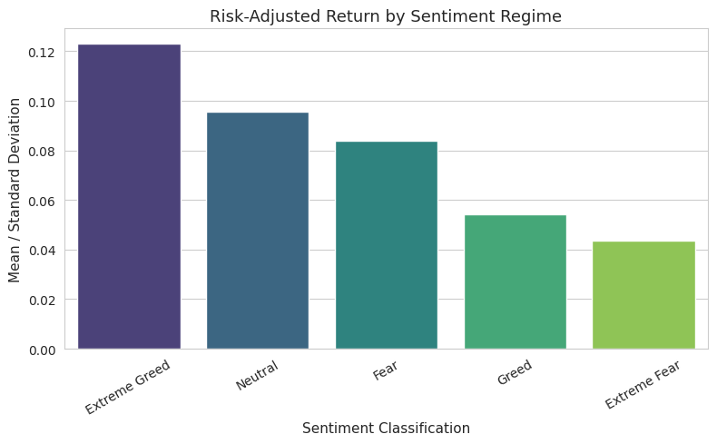
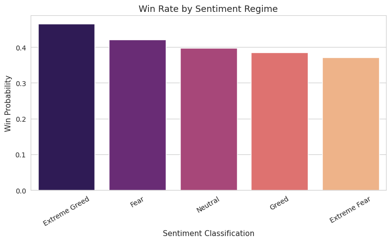
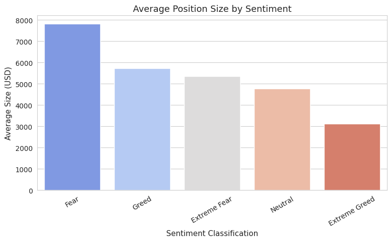

# 📊 Trader Performance vs Market Sentiment

**Author:** Hemang Krish  
**Email:** hemangkrish7@gmail.com  
**License:** Apache License 2.0  
**Project Type:** Exploratory Data Analysis (EDA)  
**Tools Used:** Python, Pandas, NumPy, Matplotlib, Seaborn  

---

## 📌 Project Overview

This project analyzes how trader profitability and behavior vary across different market sentiment regimes using the Fear & Greed Index.

The objective is to determine whether trader outcomes and risk-taking behavior are influenced by broader market sentiment conditions.

---

## 📂 Datasets Used

### 1️⃣ Historical Trades Data
- 211,224 trade records  
- Includes execution price, position size (USD), Closed PnL, trade side, timestamps, etc.  
- Time Range: May 2023 – May 2025  

### 2️⃣ Fear & Greed Index Data
- 2,644 daily sentiment observations  
- Categories:
  - Extreme Fear
  - Fear
  - Neutral
  - Greed
  - Extreme Greed  
- Time Range: February 2018 – May 2025  

---

## 🔬 Methodology

1. Cleaned and validated both datasets.
2. Converted timestamps and aligned timezones (UTC → IST).
3. Normalized both datasets to daily granularity.
4. Merged trade data with sentiment classification.
5. Removed unmatched records (only 6 rows dropped).
6. Evaluated performance and behavior across sentiment regimes.

---

## 📈 Performance Metrics

The following metrics were used to evaluate trader performance:

- **Mean Closed PnL**
- **Median Closed PnL**
- **Win Rate (Closed PnL > 0)**
- **Risk-Adjusted Return (Mean / Standard Deviation)**

Since many trades had zero PnL (partial closes or neutral adjustments), non-zero trades were analyzed separately for clearer insight.

---

## 📊 Key Findings

### 🥇 Extreme Greed
- Highest average PnL  
- Highest win rate (~46%)  
- Best risk-adjusted return  
- Strong momentum-driven efficiency  

### ⚖ Fear
- Highest trade frequency  
- Largest average position size  
- Strong profitability but higher volatility  

### ❌ Extreme Fear
- Lowest win rate (~37%)  
- Weakest risk-adjusted performance  
- Higher uncertainty without proportional reward  

---

## 📊 Visualizations

### Risk-Adjusted Return

### Win Rate by Sentiment

### Average Position Size

---

## ⚖ Risk-Adjusted Metric

A simplified Sharpe-like ratio was calculated:

Risk-Adjusted Return = Mean PnL / Standard Deviation

This measures return efficiency per unit of volatility.

Extreme Greed delivered the highest return efficiency.

---

## ⚠ Limitations

- Risk-adjusted return does not incorporate a risk-free rate.
- Analysis does not control for coin-specific effects.
- Zero-PnL trades may include partial closes.
- Observational analysis; no causal claims are made.

---

## 🚀 Conclusion

Market sentiment significantly influences trader behavior and performance.

- Momentum-driven environments (Extreme Greed) provide superior profitability and efficiency.
- Fear regimes increase trading activity and capital deployment.
- Panic-driven environments (Extreme Fear) reduce return efficiency.

These findings suggest that sentiment regimes play a meaningful role in shaping trading outcomes.

---

## ▶ How to Run

Clone the repository:

git clone https://github.com/hemangkrish7/Trader_performance_sentiment.git

Install dependencies:

pip install pandas numpy matplotlib seaborn

Open and run:

analysis.ipynb
